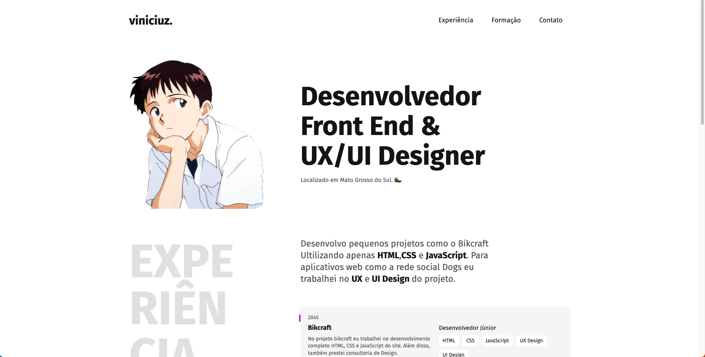

<h1>Repositório do Primeiro Portfólio Web Experimental
</h1>

 Bem-vindo ao meu portfólio experimental, um projeto onde mergulhei no mundo do desenvolvimento web, com foco especial em UI/UX design, grid e flexbox. Durante essa jornada, aprendi e explorei diversos conceitos fundamentais para a criação de interfaces visualmente atraentes e responsivas.

Com dedicação e empenho, aprimorei minhas habilidades em UI/UX design, adquirindo conhecimento sobre a importância da usabilidade, da hierarquia visual e da criação de experiências agradáveis para o usuário. Além disso, mergulhei nos princípios do design responsivo, garantindo que meu portfólio se adaptasse perfeitamente a diferentes dispositivos e tamanhos de tela. 

https://viniciuzsk.github.io/

